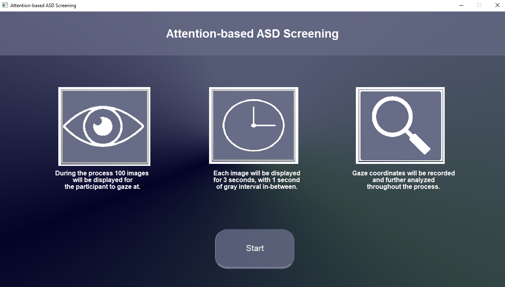
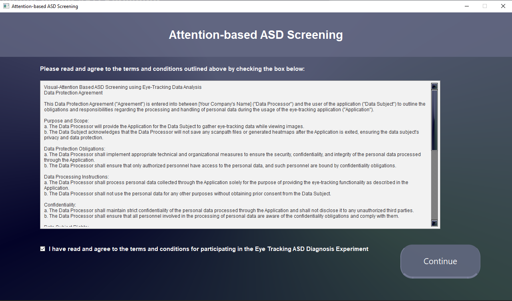
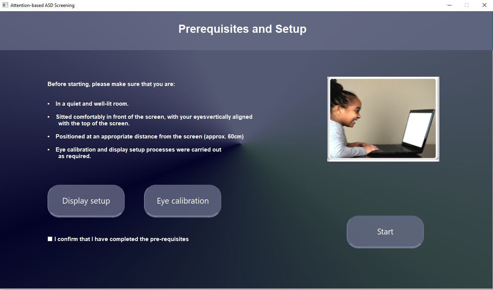
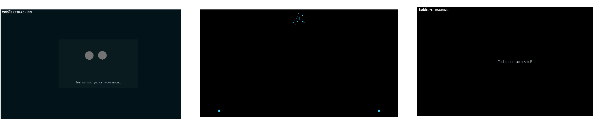
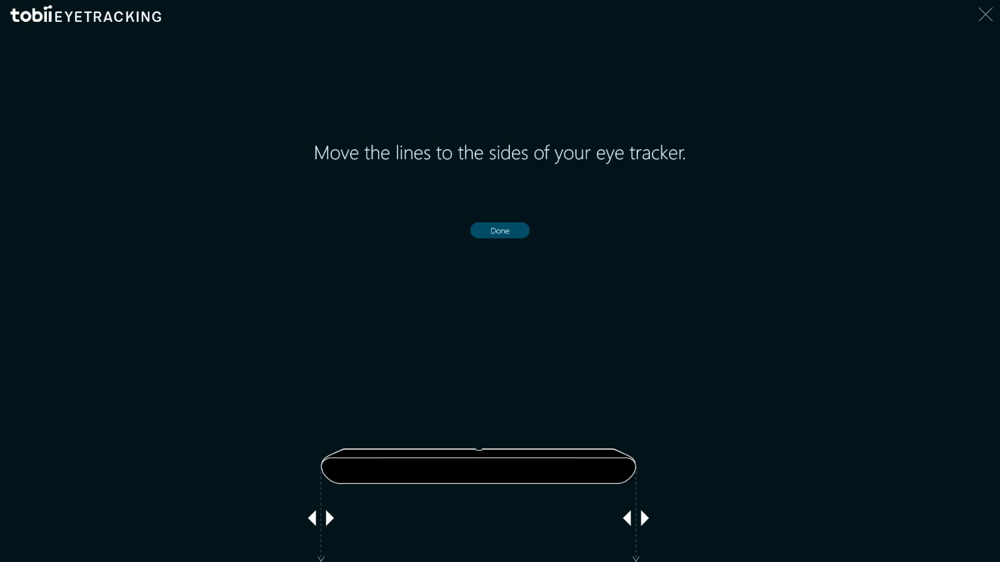
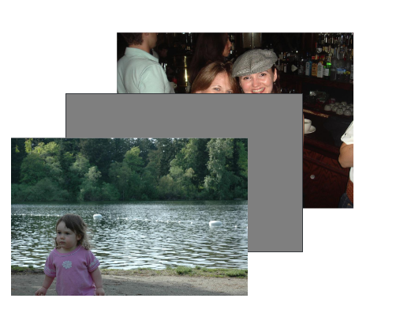
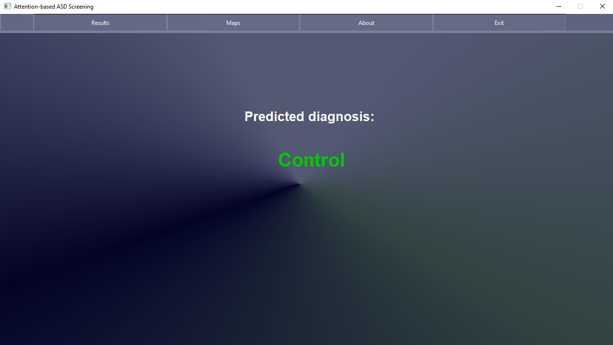
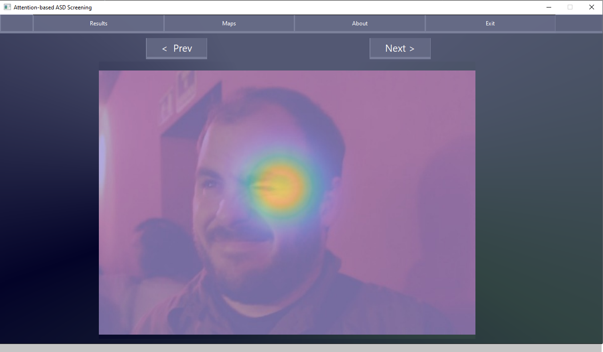

# Attention-based ASD Screening
Attention-based ASD screening software. 
It is an **ad-hoc HCI** used to predict results on handcrafted data sampled from Tobii 4C/EyeX consumer-level eye-tracking devices, while viewing 100 images from the MIT1003 dataset. 
The underlying model was trained and validated on Saliency4ASD(https://saliency4asd.ls2n.fr/datasets/) dataset[1]. 
The code is available in: https://drive.google.com/drive/folders/1L_R1JwD7o7V5iskhunCfCDeoIqK-S6H-?usp=sharing

### Simulation - Click to view the video in YT

### Requirements
1. Pytorch: We use Pytorch 1.2.0 in our experiments.
2. Tensorflow: We only use the tensorboard for visualization.
3. Python 3.6+
4. CUDA-Enabled GPU
5. MATLAB
6. Tobii Consumer Eye-Tracker Device (Tested against 4C/EyeX)
7. Latest Tobii Eye-Tracker Driver installed: `Tobii.EyeX.Interaction.exe` and `Tobii.EyeX.Configuration` should be present in the `\Tobii\Tobii EyeX Config` path in your PC.

### Data Processing
The code displays images from [Saliency4ASD](https://saliency4asd.ls2n.fr/datasets/) dataset. Please download the dataset accordingly and unzip it to folder `generated/Images`.

### Installation
Extract the folder 'PyProjects' to drive F:/ to create the path 'F:/PyProjects'. The rest is straight-forward, just run the main file and follow the instructions on the screen.
Additional instructions can be found within the 'User Guide: Operating Instructions' section of our book.

`python main.py` 

### Screenshots (Description; Image)

  <ul>
    <li>
      Welcome Screen 
    </li>
    <li>
      Data Confidentiality Agreement Screen 
    </li>
    <li>
      Calibration and Display Setup Screen 
    </li>
    <li>
      Eye-Tracker Calibration Procedure 
    </li>
    <li>
      Display Setup Procedure 
    </li>
    <li>
      Timed Image-Viewer - eye movements are recorded in the background 
    </li>
    <li>
      Results: Diagnosis Screen 
    </li>
    <li>
      Results: Generated HeatMaps Image Slider 
    </li>  
  </ul>

### Acknowledgments
We would like to thank Shi Chen et al. [1] for their valuable contribution to the field of autism research and our project.
We would like to personally thank Shi Chen for the time he has taken to answer our questions.
We would also like to thank Augusto Esteves for the GazeTrack library which we found helpful with establishing connection to a consumer-level eye tracker.
GazeTrack can be found here: https://github.com/AugustoEst/gazetrack.

### References
[1] Chen, S., & Zhao, Q. (2019). Attention-Based Autism Spectrum Disorder Screening With Privileged Modality. In The IEEE International Conference on Computer Vision (ICCV).
